# 📊 USE CASE DIAGRAM - MADRS System

## تصميم مخطط الحالات (Use Cases)

```mermaid
graph TB
    subgraph Actors["الممثلون (Actors)"]
        Admin["👨‍💼 Admin"]
        Analyst["🔍 Security Analyst"]
        Responder["🚨 Incident Responder"]
        System["⚙️ External System"]
    end

    subgraph UseCases["حالات الاستخدام (Use Cases)"]
        UC1["إدارة المستخدمين<br/>(Create/Edit/Delete)"]
        UC2["إدارة الأدوار والصلاحيات<br/>(Roles & Permissions)"]
        UC3["مراقبة لوحة التحكم<br/>(Dashboard Monitoring)"]
        UC4["عرض الحوادث والتنبيهات<br/>(View Alerts/Incidents)"]
        UC5["تحليل الحادثة<br/>(Analyze Incident)"]
        UC6["عرض خريطة MITRE<br/>(MITRE Mapping)"]
        UC7["رفع ملف PCAP<br/>(Upload PCAP)"]
        UC8["تصنيف تلقائي<br/>(Auto Classification)"]
        UC9["إنشاء التقارير<br/>(Generate Reports)"]
        UC10["إدارة قواعد جدار الحماية<br/>(Manage Firewall Rules)"]
        UC11["إدارة Webhooks<br/>(Manage Webhooks)"]
        UC12["تنفيذ الاستجابة<br/>(Execute Response)"]
        UC13["إرسال التنبيهات<br/>(Send Alerts)"]
        UC14["التسجيل والمراجعة<br/>(Audit Logging)"]
        UC15["عرض التحليلات<br/>(View Analytics)"]
    end

    %% Admin connections
    Admin -->|يقوم بـ| UC1
    Admin -->|يقوم بـ| UC2
    Admin -->|يقوم بـ| UC11
    Admin -->|يقوم بـ| UC3
    Admin -->|يقوم بـ| UC15

    %% Analyst connections
    Analyst -->|يقوم بـ| UC3
    Analyst -->|يقوم بـ| UC4
    Analyst -->|يقوم بـ| UC5
    Analyst -->|يقوم بـ| UC6
    Analyst -->|يقوم بـ| UC9
    Analyst -->|يقوم بـ| UC15
    Analyst -->|يقوم بـ| UC7

    %% Responder connections
    Responder -->|يقوم بـ| UC4
    Responder -->|يقوم بـ| UC5
    Responder -->|يقوم بـ| UC12

    %% System connections
    System -->|يقوم بـ| UC7
    System -->|يقوم بـ| UC13

    %% Include relationships (dependencies)
    UC5 -->|يشمل| UC6
    UC8 -->|يشمل| UC14
    UC12 -->|يشمل| UC10
    UC12 -->|يشمل| UC13
    UC7 -->|يشمل| UC8
    UC9 -->|يشمل| UC14

    style Admin fill:#e1f5ff
    style Analyst fill:#f3e5f5
    style Responder fill:#ffe0b2
    style System fill:#e8f5e9

    style UC1 fill:#fff9c4
    style UC2 fill:#fff9c4
    style UC3 fill:#c8e6c9
    style UC4 fill:#c8e6c9
    style UC5 fill:#b3e5fc
    style UC7 fill:#ffe0b2
    style UC8 fill:#ffccbc
    style UC12 fill:#ffccbc
    style UC13 fill:#f8bbd0
```

---

## 📋 تفاصيل الحالات (Use Cases Details)

### **1. إدارة المستخدمين** (UC1)
- **الممثل**: Admin
- **الهدف**: إضافة وتعديل وحذف المستخدمين
- **الخطوات**:
  1. Admin يدخل إلى صفحة إدارة المستخدمين
  2. يقوم بإدخال بيانات المستخدم الجديد
  3. يتم حفظ البيانات في قاعدة البيانات
  4. يتم تسجيل العملية في Audit Log

---

### **2. إدارة الأدوار والصلاحيات** (UC2)
- **الممثل**: Admin
- **الهدف**: تحديد الأدوار والصلاحيات
- **الأدوار المتاحة**:
  - `ADMIN`: صلاحيات كاملة
  - `ANALYST`: تحليل وعرض البيانات
  - `RESPONDER`: تنفيذ الاستجابة
  - `VIEWER`: عرض فقط

---

### **3. مراقبة لوحة التحكم** (UC3)
- **الممثلون**: Admin, Analyst
- **الهدف**: عرض معلومات النظام الفعلية
- **المعلومات المعروضة**:
  - عدد الحوادث والتنبيهات
  - معدل الدقة
  - آخر التهديدات المكتشفة
  - إحصائيات الأداء

---

### **4. عرض الحوادث والتنبيهات** (UC4)
- **الممثلون**: Analyst, Responder
- **الهدف**: عرض قائمة الحوادث والتنبيهات
- **المعلومات المعروضة**:
  - IP المصدر والوجهة
  - نوع الهجوم المتنبأ به
  - درجة الثقة
  - حالة الحادثة (جديدة/تمت الموافقة عليها/محلولة)

---

### **5. تحليل الحادثة** (UC5) ← **يشمل** UC6
- **الممثلون**: Analyst, Responder
- **الهدف**: فحص تفاصيل الحادثة بالكامل
- **الخطوات**:
  1. اختيار الحادثة
  2. عرض البيانات المفصلة (flows, features)
  3. عرض خريطة MITRE (UC6)
  4. إضافة ملاحظات

---

### **6. عرض خريطة MITRE** (UC6)
- **الممثلون**: Analyst
- **الهدف**: عرض تقنيات MITRE ATT&CK المرتبطة
- **المعلومات المعروضة**:
  - Tactic
  - Technique
  - Sub-technique
  - وصف التقنية

---

### **7. رفع ملف PCAP** (UC7) ← **يشمل** UC8
- **الممثلون**: Analyst, External System
- **الهدف**: رفع ملف PCAP للتحليل
- **الخطوات**:
  1. اختيار ملف PCAP
  2. رفع الملف إلى الخادم
  3. استخراج البيانات (Flows)
  4. تشغيل التصنيف التلقائي (UC8)

---

### **8. التصنيف التلقائي** (UC8) ← **يشمل** UC14
- **الممثل**: System
- **الهدف**: تصنيف الحوادث تلقائياً باستخدام ML
- **الخطوات**:
  1. استخراج 77 feature من البيانات
  2. إرسال إلى ML Service
  3. الحصول على التنبؤ والثقة
  4. حفظ النتيجة (UC14)

---

### **9. إنشاء التقارير** (UC9)
- **الممثل**: Analyst
- **الهدف**: إنشاء تقارير شاملة للحوادث
- **صيغ التقارير**:
  - PDF (تقرير شامل مع رسوم بيانية)
  - CSV (بيانات خام للتحليل)
  - JSON (بيانات منظمة)

---

### **10. إدارة قواعد جدار الحماية** (UC10)
- **الممثل**: Admin
- **الهدف**: إضافة وتعديل قواعد الحماية
- **أنواع القواعد**:
  - Block (حجب)
  - Allow (السماح)
  - Log (تسجيل فقط)

---

### **11. إدارة Webhooks** (UC11)
- **الممثل**: Admin
- **الهدف**: تكوين التنبيهات الخارجية
- **الخطوات**:
  1. إضافة رابط Webhook
  2. اختيار نوع الأحداث
  3. اختبار الاتصال
  4. تفعيل/تعطيل

---

### **12. تنفيذ الاستجابة** (UC12) ← **يشمل** UC10, UC13
- **الممثل**: Responder
- **الهدف**: تنفيذ إجراءات الاستجابة
- **الإجراءات**:
  - حجب IP من خلال جدار الحماية (UC10)
  - إرسال تنبيه (UC13)
  - إنهاء الاتصال
  - عزل الجهاز

---

### **13. إرسال التنبيهات** (UC13)
- **الممثل**: System
- **الهدف**: إرسال تنبيهات إلى الفريق
- **قنوات التنبيهات**:
  - Webhook
  - Email
  - SMS
  - Push Notification

---

### **14. التسجيل والمراجعة** (UC14)
- **الممثل**: System
- **الهدف**: تسجيل جميع العمليات
- **المعلومات المسجلة**:
  - نوع العملية
  - المستخدم
  - الوقت
  - التفاصيل

---

### **15. عرض التحليلات** (UC15)
- **الممثلون**: Admin, Analyst
- **الهدف**: عرض إحصائيات الأداء
- **المقاييس المعروضة**:
  - معدل الدقة
  - الحوادث المكتشفة يومياً
  - الهجمات الشائعة
  - نسبة الاستجابة

---

## 🔗 العلاقات والتبعيات

| العلاقة | النوع | الوصف |
|--------|-------|-------|
| UC5 → UC6 | Include | تحليل الحادثة يشمل عرض MITRE |
| UC8 → UC14 | Include | التصنيف يتطلب تسجيل العملية |
| UC12 → UC10 | Include | الاستجابة قد تتطلب تحديث جدار الحماية |
| UC12 → UC13 | Include | الاستجابة تتطلب إرسال تنبيهات |
| UC7 → UC8 | Include | رفع PCAP يؤدي للتصنيف التلقائي |

---

## 👥 مصفوفة الصلاحيات

| الحالة | Admin | Analyst | Responder | Viewer |
|--------|-------|---------|-----------|--------|
| UC1 - إدارة المستخدمين | ✅ | ❌ | ❌ | ❌ |
| UC2 - إدارة الأدوار | ✅ | ❌ | ❌ | ❌ |
| UC3 - Dashboard | ✅ | ✅ | ✅ | ✅ |
| UC4 - عرض الحوادث | ✅ | ✅ | ✅ | ✅ |
| UC5 - تحليل الحادثة | ✅ | ✅ | ✅ | ❌ |
| UC7 - رفع PCAP | ✅ | ✅ | ❌ | ❌ |
| UC9 - إنشاء التقارير | ✅ | ✅ | ❌ | ❌ |
| UC12 - الاستجابة | ✅ | ❌ | ✅ | ❌ |

